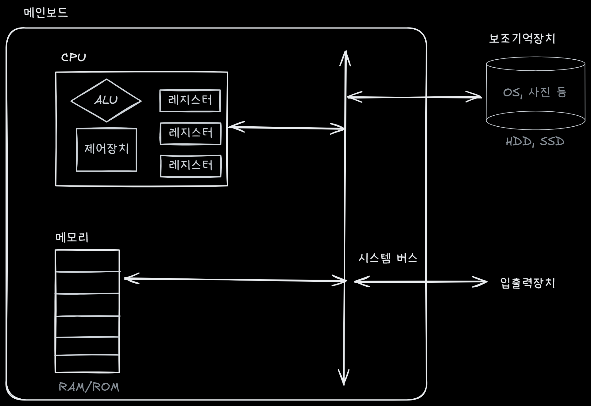
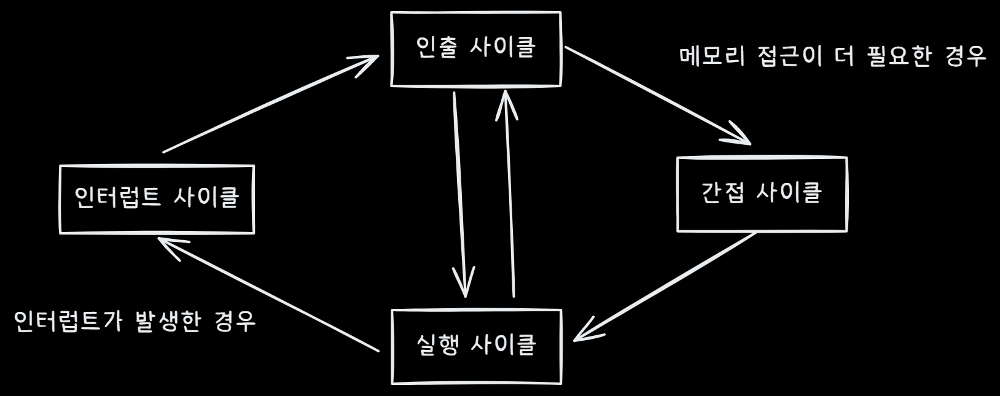

## 📖 CPU & Pipeline
### 0. Hardware 구성 요소

  

  <em>Figure 1. Big Picture of Computer Architecture</em>

|구성 요소|역할|핵심 특징|성능 관점에서의 포인트|
|--|--|--|--|
|CPU|명령어 해석 및 실행|ALU, 제어장치, 레지스터로 구성|클럭, 파이프라인, 병렬성에 의해 성능 결정|
|메인 메모리|실행 중인 프로그램과 데이터 저장|랜덤 접근 가능 (RAM),, 휘발성|대역폭·지연시간이 CPU 성능의 상한을 결정|
|시스템 버스|CPU–메모리–I/O 연결|주소/데이터/제어 버스로 구성|병목 발생 시 전체 시스템 성능 저하|
|보조기억장치|영구 데이터 저장|비휘발성, 대용량 (SSD/HDD)|접근 속도가 느려 계층 구조 필요|
> 👉 CPU가 아무리 빨라도 메모리·버스가 느리면 전체 시스템은 느림. (Von Neumann Bottleneck)
---
### 1. CPU 상세구조 (1) : ALU & Flag
> ALU는 계산을 수행하고, Flag는 그 결과의 ‘의미’를 요약한 메타데이터

- 🚩 **Flag Register (상태 레지스터)**:
  |Flag|의미 (1일 때)|해석 포인트|실무 연결|
  |--|--|--|--|
  |ZF (Zero)|결과가 0	|동일성 비교	|`if (x == y)`|
  |SF (Sign)	|음수|	MSB 기준 부호|	signed 비교|
  |CF (Carry)	|자리올림/빌림	|Unsigned 오버플로우|	비트 연산|
  |OF (Overflow)	|범위 초과	|Signed 오버플로우	|정수 에러|
  |IF (Interrupt)	|인터럽트 허용	|비동기 이벤트	|OS 개입|
  |UI (User/Super)	|권한 상태	|실행 모드|	보안|
  - ⚠️ CF vs OF  
    - `CF` : 하드웨어적 관점. 연산 결과 비트가 정해진 길이를 넘었는가?
    - `OF` : 논리적 관점. 연산 결과가 인간이 의도한 부호 체계 내에서 표현 가능한가?

---
### 2. CPU 상세구조 (2) : Control Unit
> 제어장치는 CPU의 두뇌 “무엇을, 언제, 어디서” 실행할지를 결정

- 📊 **제어장치의 입출력 체계**:
  | 구분 | 항목 (Items) | 주요 기능 및 목적 (Description & Purpose) |
  |------|-------------|--------------------------------------------|
  | Input (정보 수신) | `명령어 레지스터 (IR)` | 현재 수행 중인 명령어의 비트 패턴을 수신하여 **연산 종류를 해독(Decoding)**함 |
  |  | `플래그 레지스터 (FLAGS)` | ALU의 연산 결과 상태를 참조하여 조건부 분기(Jump) 여부 등을 판단함 |
  |  | 제어 버스 신호 | 메모리 또는 입출력 장치(I/O)로부터 전달된 외부 요청 및 상태 신호를 수신함 |
  |  | `클럭 (Clock)` | 모든 구성 요소가 발맞추어 동작할 수 있도록 **동기화 기준(Timing)**을 제공받음 |
  | Output (명령 하달) | CPU 내부 제어 신호 | ALU의 연산 실행, 레지스터 간 데이터 이동, 내부 버스 점유 등을 지시함 |
  |  | CPU 외부 제어 신호 | 제어 버스를 통해 메모리 인터페이스(읽기/쓰기) 및 주변 장치의 동작을 제어함 |

- ⏱ **Clock 신호**:
  - **동기화의 기준**: CPU 내 모든 동작을 조율하는 규칙적인 전기 펄스 (1 Clock = 1 Step).
  - **성능과 발열**: Clock 속도($Hz$)를 높이면 초당 처리량은 늘어나지만, 전력 소모와 발열이 지수적으로 폭증  
  - **해결책**: 현대 CPU는 단일 클럭을 높이는 대신 파이프라인(Pipeline) 및 병렬 처리를 통해 성능을 개선 
  
---
### 3. CPU 상세구조 (3) : Register Set
> CPU 내부에 위치한 초고속 저장소로, 연산에 직직결되는 데이터와 상태를 보관하여 메모리(RAM) 접근 빈도를 최소화함

- 📍핵심 레지스터 :
  |종류|명칭|주요 역할 (Role)|
  |--|--|--|
  |PC|프로그램 카운터|**다음에 실행할** 명령어의 메모리 주소를 가리킴|
  |IR|명령어 레지스터|메모리에서 가져온 **현재 실행 중인 명령어** 자체를 저장|
  |MAR|메모리 주소 레지스터|읽거나 쓰고자 하는 메모리의 **주소**를 임시 저장|
  |MBR|메모리 버퍼 레지스터|메모리와 주고받는 **실제 데이터**를 잠시 담아두는 통로|
  |Flag|플래그 레지스터|연산 결과의 상태(0, 음수, 오버플로우 등)를 기록|
  |GPR|범용 레지스터|데이터나 주소를 가리지 않고 범용적으로 사용하는 저장소|
  |SP|스택 포인터|메모리 내 **스택(Stack) 영역의 최상단 주소**를 가리킴|
  |BP / FP|베이스/프레임 포인터|함수 호출 시 지역 변수 참조를 위한 **고정 기준 주소** 보관|

---
### 4. 레지스터 기반 주소 지정 (Addressing Mode)
> 명령어 내의 제한된 비트 공간을 활용하여 광범위한 메모리 주소를 효율적으로 참조하기 위한 전략
#### 4.1. 스택 주소 지정 방식 (Stack Addressing)
- **메커니즘**: 명령어에 주소를 명시하지 않고, **스택 포인터(`SP`)**가 가리키는 지점을 묵시적으로 참조
  - 메모리 내 스택이 사용할 영역(스택 영역)이 지정되어 있음 
- **주요 용도**: 함수 호출 시 복귀 주소 저장, 매개변수 전달, 지역 변수 할당 등에 활용 
- **실무적 의미**: 재귀 함수 호출이 깊어질 경우 `SP`가 정해진 메모리 한계를 넘는 Stack Overflow의 직접적인 원인이 됨

#### 4.2. 변위 주소 지정 방식 (Displacement Addressing)
- **개념** : 연산코드 + 기준 레지스터(Base) + 명령어의 operand을 조합하여 유효 주소 계산
  |방식|수식 (Effective Address)|주요 활용 및 실무 연결|
  |--|--|--|
  |상대 주소 지정|`PC + Displacement`|현재 명령어 위치 기준 분기 처리 (`if`, `goto`)|
  |베이스 레지스터|`BP + Displacement`|함수 프레임 내의 지역 변수 및 매개변수 접근|
  |인덱스 레지스터|`Reg + (Index * Scale)`|배열(Array)이나 구조체의 연속된 요소 접근 시 최적화|
---
### 5. CPU Instruction Cycle

  

  <em>Figure 2. CPU Cycle</em>

| 단계 | 명칭 | 역할 | 실무/하드웨어 감각 |
| -- | -- | --| --|
| 1  | **Fetch (인출)**  | PC가 가리키는 메모리에서 명령어를 읽어서 IR에 저장 | - 명령어 레지스터(IR)로 이동 - 메모리 접근 → L1/L2/L3 캐시 영향 - 메모리 느리면 ALU idle |
| 2  | **Indirect (간접 주소 해석)**    | 명령어가 참조하는 주소가 간접(Addressing Mode: Base+Index, Stack 등)이면 실제 유효 주소(EA)를 계산 | - ALU로 주소 계산 - Base + Index + Displacement 적용 - 메모리 접근 패턴에 따라 캐시 히트/미스 발생 |
| 3  | **Execute (실행)**  | ALU 연산, 레지스터 이동, 메모리 읽기/쓰기 수행  | - 실제 연산 수행 - ZF/SF/CF/OF 플래그 갱신 - Load/Store이면 메모리 접근 발생 - Branch 명령이면 Control Unit이 다음 PC 결정  |
| 4  | **Interrupt/Exception 처리** | 외부 장치 요청이나 예외 상황 발생 시 명령어 중단, OS/Handler 호출  | - IF(Interrupt Flag) 체크 후 처리 - Context Switch 발생 → Pipeline flush - Fault/Trap/Abort 구분 - 처리 완료 후 복귀 |
> 🔑 핵심: 각 단계마다 **CPU가 연산을 기다리는 시간이 어디서 발생하는지**가 성능과 안정성을 결정
> 
---
### 6. Exception & Interrupts
> CPU가 명령어를 실행하는 도중, 비정상적인 상황이나 외부 기기의 요청이 발생했을 때 현재 작업을 중단하고 긴급 대응하는 메커니즘

#### 6.1. 발생 원인에 따른 분류 (동기 vs 비동기)
|구분/발생 |원인주요 |특징|처리 후 복귀|예시|
|--|--|--|--|--|
|동기 (Exception)|CPU 내부에서 명령어 실행 도중 발생 (예외)|프로그래밍 에러나 시스템 호출 시 발생 (0으로 나누기, Page Fault, Trap)|상황에 따라 재실행 혹은 종료|Page Fault, System Call, CPU 오류|
|비동기 (Interrupt)|CPU 외부 하드웨어 장치에 의해 발생 (인터럽트)입출력 완료| 타이머 종료 등 예측 불가능한 시점에 발생|항상 원래 명령어로 복귀|대용량 데이터 전송, OS 스케줄링 타이머, 키보드 입력|

- **Interrupt** = 외부 이벤트 → CPU 멈춤 → 처리 후 돌아감
- **Exception** = 명령어 수행 중 문제 → Fault는 재시도, Trap은 다음 명령어, Abort는 종료
- 최적화 전략 = “인터럽트·컨텍스트 스위치·I/O·분기”에 드는 비용을 최소화 → CPU 연산이 멈추는 시간을 줄임
---
#### 6.2. 처리 우선순위에 따른 분류 (Maskable vs Non-Maskable)
> 제어 장치는 플래그 레지스터의 `IF`(Interrupt Flag) 비트를 보고 신호를 수용할지 결정

|분류|제어 가능 여부|특징 및 예시|
|--|--|--|
|가면 인터럽트 (Maskable, INTR)|막을 수 있음|IF 비트가 0(Disable)이면 CPU가 무시함. 일반적인 I/O 요청
|불가면 인터럽트 (Non-Maskable, NMI)|막을 수 없음|IF 비트와 상관없이 즉시 처리. 전원 오류, 하드웨어 치명적 고장 등|
---
#### 6.3. 인터럽트 및 예외 처리 순서 (Hardware Flow)
> 인터럽트 신호가 접수되면 CPU 하드웨어는 자동으로 아래 단계를 수행하여 시스템 상태를 보존 
1. **명령어 중단**: 현재 실행 중인 명령어의 단계(Cycle)를 마무리함
2. **상태 백업 (Context Save)**: 현재의 PC(Program Counter), Flag Register 등 핵심 정보를 메모리 내 스택(Stack) 영역에 저장
3. **인터럽트 판별**: 누가 요청을 보냈는지 **인터럽트 벡터(ID)**를 확인
4. **루틴 점프**: 인터럽트 벡터 테이블에서 해당 ID에 맞는 ISR(인터럽트 서비스 루틴) 주소로 PC를 갱신
5. **ISR 실행**: 제어권이 OS로 넘어가 실질적인 인터럽트 원인을 해결
6. **상태 복구 (Context Restore)**: 스택에 저장해두었던 레지스터 값을 원래대로 복원
7. **작업 재개**: 백업된 PC 값을 참조하여 중단되었던 지점부터 다시 실행
---
#### 6.4. 예외(Exception)와 인터럽트의 세부 구분
| 구분 | 종류 | 특징 | 복구 방식 |
| :--- | :--- | :--- | :--- |
| **비동기** | **Interrupt** | 외부 장치 요청 (I/O, 타이머) | 처리 후 다음 명령어부터 재개 |
| **동기** | **Fault** | 명령어 실행 중 오류 (Page Fault) | 원인 해결 후 **해당 명령어 재실행** |
| | **Trap** | 의도적 호출 (System Call, Debug) | 처리 후 **다음 명령어**부터 재개 |
| | **Abort** | 하드웨어 치명적 오류 | 복구 불가능 (종료) |

> 🔑 **복구의 핵심**: CPU는 예외 발생 시 현재 상태를 **스택(Stack)**에 자동 보관하며, 처리가 끝나면 스택의 정보를 복원하여 중단된 지점으로 복귀함.
---
#### 💡 Supplemental: 성능의 임계점 (Memory Wall)
> CPU는 ALU로 연산은 순식간에 끝내지만, 메모리에서 데이터를 가져오는 속도가 훨씬 느리다. 반복문이 많거나 중첩되면 이 느린 메모리를 자주 접근하게 되어 ALU는 대부분 기다리는 상태가 된다.

- ⚡ 메모리 계층별 접근 속도 (Latency)
  | 구분          | 속도           |
  | ----------- | ------------ |
  | CPU 레지스터    | ~1 사이클       |
  | L1 캐시       | ~4 사이클       |
  | L2 캐시       | ~12 사이클      |
  | L3 캐시       | ~40 사이클      |
  | 메인 메모리(RAM) | ~100–200 사이클 |
  - **결론**: CPU가 1번 연산할 동안 메모리에서 데이터를 가져오려면 수십~백 클럭을 기다려야 함
  - **최적화 팁**: 
    - 1. **캐시 미스(Cache Miss) 방지**: 중첩 루프 사용 시 데이터 접근 패턴을 불연속적으로 설계하면 CPU는 연산보다 데이터를 기다리는 데 90% 이상의 시간을 낭비한다. 
    - 2. **연속적 배치**: 데이터를 메모리에 순차적으로 배치(Locality)하여 변위 주소 지정의 효율성을 극대화해야 한다.
---
#### 💡 Supplemental: 스택 작업 비용 & Interrupt / Context Switch
|단계|물리적 동작|성능 임팩트 (Cost)|
|--|--|--|
|Context Save|현재 레지스터(PC, Flags 등)를 스택에 저장|메모리 쓰기 발생 (캐시 미스 시 100+ 사이클)|
|Pipeline Flush|실행 중이던 파이프라인의 명령어를 모두 폐기|처리 중인 연산 흐름이 끊김 (Stall 발생)
|ISR 실행|인터럽트 서비스 루틴으로 점프 및 실행|제어권 이동에 따른 오버헤드|
|Restore|스택에서 데이터를 꺼내 레지스터 복구|메모리 읽기 발생 (캐시 미스 시 100+ 사이클)|

> 🔑 **핵심**: 인터럽트와 예외 처리는 하드웨어가 "자동"으로 해주지만, 그 과정에서 발생하는 메모리 접근과 파이프라인 중단 비용은 공짜가 아니다. 빈번한 인터럽트와 깊은 스택 접근은 현대 CPU 성능 최적화의 최대 적이다.
---
#### 💡 Supplemental: 시스템 최적화 설계 전략 (Hardware-Software Alignment)
> 인터럽트와 스택 작업의 물리적 비용(Latency)을 최소화하기 위한 전략

|최적화 대상	|설계 전략 (Design Strategy)	|기대 효과 및 기술적 근거|
|--|--|--|
|인터럽트 오버헤드|	Polling 및 Batching 활용|	수신 신호마다 발생하는 Context Save 횟수를 줄여 CPU 연산 효율성 확보|
|컨텍스트 스위칭|	Event-driven / Non-blocking 설계|	스레드 간 전환 시 발생하는 레지스터 백업 비용을 제거하고 파이프라인 연속성 유지|
|스택 메모리 관리|	Tail Call Optimization / Inlining|	함수 프레임 생성에 따른 스택 접근(Memory Access) 및 캐시 미스 최소화|
|I/O 대기 시간|	Asynchronous I/O & DMA 활용|	데이터 전송 중 CPU 개입을 차단하여 Pipeline Flush 및 대기 상태(Idle) 방지|
|분기 예측 효율|	Conditional Move / Branchless 코드	|제어 장치의 분기 판단에 따른 플래그 참조와 그로 인한 파이프라인 중단 방지|
---
#### 💡 Ex : 매일 밤 반복 작업 최적화
1. **배치 처리**: 하루치 로그·데이터를 모아서 한 번에 DB 쓰기
2. **비동기 I/O**: 파일 읽기/쓰기 중 CPU는 다른 연산 진행
3. **스레드 최소화**: 이벤트 루프 기반으로 컨텍스트 스위치 최소화
4. **캐시 친화적 알고리즘**: 반복문에서 배열 순서대로 처리 → 메모리 접근 효율 극대화
5. **분기 예측 고려**: 반복문 내 if/else 최소화, branchless로 구현
---